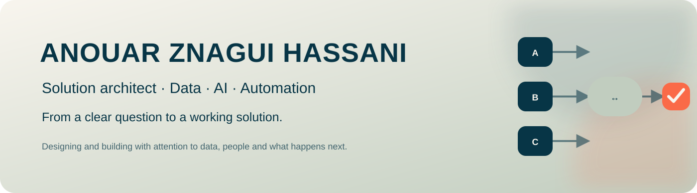

# Anouar Znagui Hassani

**Solution architect · Data, AI and automation · Nijmegen**

I design and build practical solutions at the intersection of data, AI and automation. My starting point is the work that needs to improve: which decision should become clearer, which action can become simpler, and who will use the result?

## What I work on

- Data platforms, integrations and reliable definitions
- AI applications that fit real workflows
- Architecture that can be built, tested and maintained
- Governance with access rights, human control, logging and monitoring

## How I work

I start with the problem, connect strategy to architecture, and build toward something people can use. I make assumptions visible, test with practical situations and keep ownership clear after delivery.

## Current project

[Data Changes Council](https://github.com/anouar-zh/data-changes-council) is an open source experiment in multi-model deliberation. It compares independent LLM answers, keeps dissent visible, and puts human approval before external actions.

## Connect

- LinkedIn: [Anouar Znagui Hassani](https://www.linkedin.com/in/anouar-znagui-hassani/)

I share lessons from building, not just finished diagrams.
